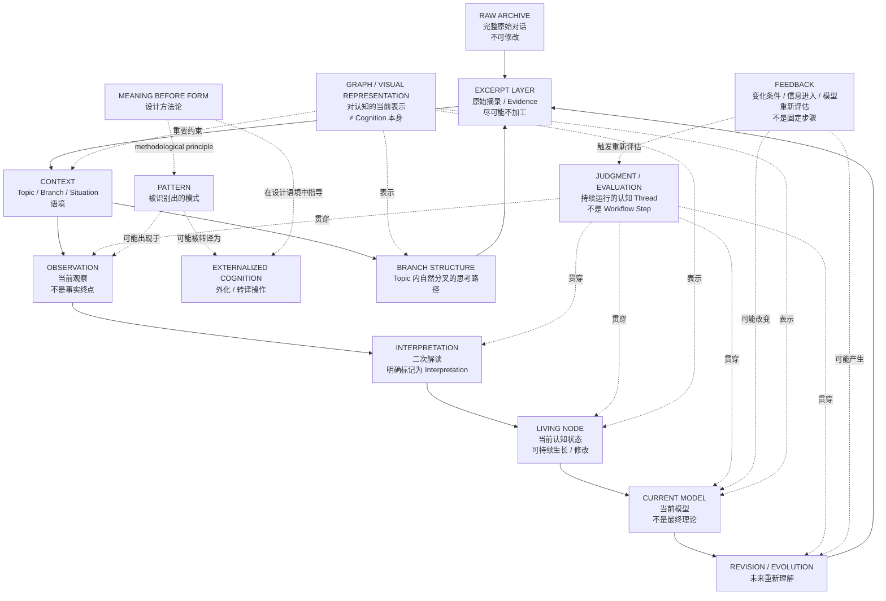

# Branch · 个人认知基础设施构建

**User:** Anonymous  
**Created:** 8/13/2026 14:08:44  
**Updated:** 9/8/2026 13:05:21  
**Exported:** 9/8/2026 13:06:12  
**Link:** [https://chatgpt.com/g/g-p-6a12231c6ef081918e8cc9e421ef6cfb/c/6a7db215-b254-83eb-9dba-9fc746d9e727](https://chatgpt.com/g/g-p-6a12231c6ef081918e8cc9e421ef6cfb/c/6a7db215-b254-83eb-9dba-9fc746d9e727)  

## Prompt:
08/09/2026, 13:04:54

你能把我们目前的额这套系统整理成一个可复制的graph吗

## Response:
08/09/2026, 13:04:57

可以。而且我觉得现在已经到了**第一次把它固定成“可复制 Graph”**的时机。

但我不会把它做成刚才那种“认知过程 = A → B → C”的流程图。我们现在已经明确了：**Graph 是 archive / representation，不是 cognition 的真实 1:1 复刻。**

所以我建议先做一个 **Living Nodes System — Graph v0.3**，用 Mermaid 表达。它可以直接复制到 Obsidian、GitHub、Notion（视渲染支持情况）或者之后转成其他 graph format。

### Living Nodes System — Graph v0.3



### 但这个 Graph 有一个非常重要的阅读规则

它里面的实线和虚线**不是同一种关系**。

例如：

```text
RAW → EXCERPT → CONTEXT → OBSERVATION → INTERPRETATION
```

这是我们的**档案生产 / epistemic layering**。

而：

```text
JUDGMENT -.贯穿.-> OBSERVATION
JUDGMENT -.贯穿.-> MODEL
JUDGMENT -.贯穿.-> REVISION
```

不是 workflow。

它表达的是你刚才说的那个东西：

> **Judgment / Evaluation 是一个一直在工作的 parallel thread。**

同样：

```text
FEEDBACK
```

也不能理解成：

```text
Step 6: Feedback
```

它只是一个可能进入系统、促使现有模型重新被判断的条件。

---

## 还有一个我认为必须保留的“核心约束”

如果把整个系统再压缩成最底层的 Graph，我们现在实际上可以得到：

```text
                         ┌─────────────────────┐
                         │      CONTEXT        │
                         │  决定解释的语境      │
                         └─────────┬───────────┘
                                   │
                                   ▼
RAW ──────→ EXCERPT ──────→ OBSERVATION
                              │
                              ▼
                         INTERPRETATION
                              │
                              ▼
                         LIVING NODE
                              │
                              ▼
                       CURRENT MODEL
                              │
                              ▼
                        FUTURE REVISION
                              │
                              └──────────────→
                                   Evidence

       ┌──────────────────────────────────────────┐
       │       JUDGMENT / EVALUATION THREAD       │
       │                                          │
       │   continuously operating / parallel     │
       └──────────────────────────────────────────┘

       ┌──────────────────────────────────────────┐
       │      GRAPH = REPRESENTATION ONLY        │
       │      ≠ COGNITION ITSELF                 │
       └──────────────────────────────────────────┘
```

我会把这两个东西视为目前的**系统级 invariants**：

> **Context Primacy**  
> Node 和 Relation 的意义不能脱离产生它们的 context 判断。

以及：

> **Representation ≠ Reality**  
> 我们画出来的 Graph 是对认知过程的当前表示，不是认知过程本身。

---

### 最关键的一点

**现在不要把 `Pattern / Meaning Before Form / Externalized Cognition / Feedback / Judgment` 全部塞进同一个“Node hierarchy”。**

它们现在已经明显处于不同维度：

| 对象 | 当前暂定性质 |
|---|---|
| Pattern | observed cognitive pattern |
| Meaning Before Form | design methodology |
| Externalized Cognition | cognitive operation / translation |
| Judgment / Evaluation | continuous parallel thread |
| Feedback | change / information condition |
| Context | interpretive environment |
| Living Node | current knowledge state |
| Model | current explanatory structure |
| Excerpt | raw evidence |
| Graph | representation |

这张表本身也**不是最终 ontology**。它只是我们截至现在的状态。

所以我建议把上面那份 Mermaid **直接作为 `Living Nodes System — Graph v0.3` 保存**，而不是继续优化成一个“更漂亮、更严谨”的最终架构。

因为我们现在终于有了一个很重要的东西：

**这个 Graph 自己也可以成为 Living Node。**

以后如果五年后的证据告诉我们 `Judgment` 根本不应该叫 Thread，或者 `Externalized Cognition` 应该被拆成两个完全不同的东西，我们直接在 v0.4、v0.5 继续长，而不是回头假装 v0.3 从一开始就是正确答案。


---
Powered by [ChatGPT Exporter](https://www.chatgptexporter.com)